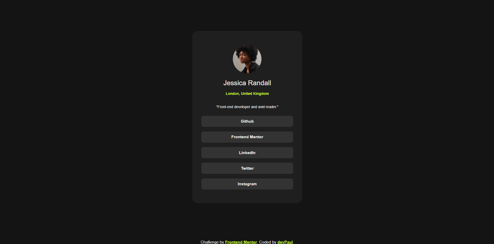

# Frontend Mentor - Social links profile solution

This is a solution to the [Social links profile challenge on Frontend Mentor](https://www.frontendmentor.io/challenges/social-links-profile-UG32l9m6dQ). Frontend Mentor challenges help you improve your coding skills by building realistic projects. 

## Overview

### The challenge

Your challenge is to build out this social links profile and get it looking as close to the design as possible.

Users should be able to:

- See hover and focus states for all interactive elements on the page

### Screenshot

### Links

- Solution URL: [**Link to my solution**](https://www.frontendmentor.io/solutions/frontend-mentor-social-links-profile-7Z8GArzGfW)
- Live Site URL: [https://dev-paull.github.io/social-links-profile/](https://dev-paull.github.io/social-links-profile/)

## My process

### Built with

- Semantic HTML5 markup
- CSS custom properties
- Flexbox
- Mobile-first workflow

### Continued development

I don't have access to the Frontend Mentor Pro version, which includes Figma files for some projects. Instead, I practice my attention to detail by closely replicating the original designs based on screenshots rather than mockups.

